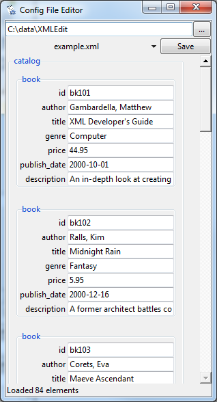

# XMLEdit
A python program with a Tkinter GUI to read and edit XML files in a human-friendly way. 

Tested in Windows and Linux, python2 and python3. 

Current attributes and tag contents can be edited; no new attributes or tags can be created. This program was written specifically for wide char config files generated by MS .net, but should work with any xml file.

Type in a directory or browse to one using the "..." button. A list of files matching the extensions in the options file will be made and populate the dropdown. 

Select a file from the dropdown to load it.

Save a file by pressing the "Save" button or "Ctrl-s". The current file is renamed with a current timestamp, and the new file is written in it's place. A program option (set in reader_options.json) allows the program to try to match the encodeing of the source. The written file is prettified (by beautifulsoup) to make it human-readable. The BS prettify is a bit different from MS but not much. 

The program will also open a file given as a command line argument, which means you can associtate this program with .xml files to open them by doubleclick or from the explorer right click menu. 

